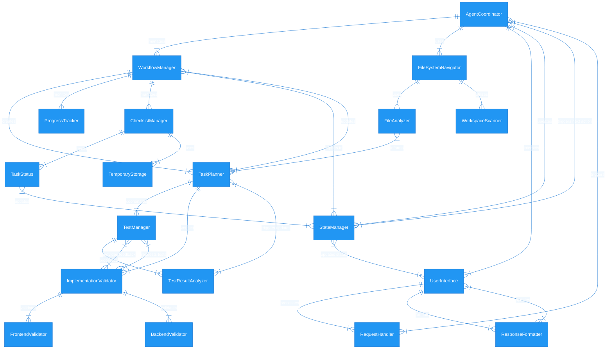

# Roadmap.md for CodeMate-projektet 🚀

---

## Översikt

CodeMate ska leverera en robust, skalbar och effektiv plattform med fokus på:

- **Core Components:**  
  - *AgentCoordinator*  
  - *WorkflowManager*  
  - *StateManager*  
  - *MemoryManager*

- **Saknade Moduler (bygga från grunden):**  
  - LLM Integration Module  
  - Code Generation Module  
  - Project Analysis Module  
  - Code Analysis API  
  - Validation Strategies & Dynamic Rule Generation  
  - Context Priority & Persistence System

- **Kritiska Integrationer:**  
  - Event System Integration (inkl. persistence, filtering & routing)  
  - Memory System Integration  
  - Validation System Integration  
  - Central Integration Layer

- **Ytterligare Funktioner & Optimeringar:**  
  - Request Validation (med rate limiting & prioritering)  
  - Memory Optimization & Indexing  
  - Template Management System  
  - Task Orchestration, ResourceMonitor, DependencyGraph, MilestoneTracker och TaskEventBus

---

## Prioriteringsordning

- 🔴 **Hög Prioritet:** Kritiska funktioner som måste implementeras först.  
- 🟡 **Medel Prioritet:** Förbättrar integration, prestanda och robusthet.  
- 🔵 **Låg Prioritet:** Avancerade funktioner och optimeringar som kan byggas ut senare.

---

## Fas 1 – Kärnfunktionalitet (Hög Prioritet) 🔴

- **AgentCoordinator:**  
  - Implementera **LLM Integration Module** för AI-assisterade operationer.  
  - Förbättra felhantering med återhämtningsstrategier (Error Recovery).  
  - Införa **Task Orchestration** för att koordinera komplexa uppgifter.

- **WorkflowManager:**  
  - Fullständig implementation av workflow-steg:  
    - Filanalys  
    - Planering  
    - Implementation  
    - Testning  
    - Validering  
    - Användarinteraktion  
  - Införa **workflow templates** & **checkpointing**.

- **StateManager:**  
  - Införa strikt **state transition validation** för att förhindra ogiltiga övergångar.  
  - Implementera rollback-funktioner och **state persistence** (med historikstädning).

- **Event System:**  
  - Koppla samman eventhantering mellan alla kärnkomponenter.  
  - Införa **Event Persistence** samt grundläggande filtering och routing.

- **Request Validation:**  
  - Implementera ett robust **Request Validation System** (struktur, innehåll, rate limiting och prioritering).

---

## Fas 2 – Utökad Integration (Medel Prioritet) 🟡

- **Saknade Moduler:**  
  - **Code Generation Module:** Automatisk kodgenerering med syntaxvalidering och stilformatering.  
  - **Project Analysis Module:** Analysera projektstruktur med dependency graphs, kodmetrik och mönsterdetektion.  
  - **Code Analysis API:** Djupare kodanalys, metrikberäkning och identifiering av kodproblem.

- **Memory & Context:**  
  - **Memory System Integration:** Koppla MemoryManager med ContextManager och WorkflowManager för långsiktig persistens och optimering.  
  - **Context Priority & Persistence:** Införa prioriteringslogik och lagring för relevanta kontextdata.

- **Validation:**  
  - Utveckla **Validation Coordinator** med en **Rule Engine**.  
  - Införa grundläggande **Validation Strategies** (t.ex. för Python och JavaScript) samt dynamisk regelgenerering.

- **Testinfrastruktur:**  
  - Bygg en omfattande testmiljö med enhets-, integrations- och prestandatester.

- **Utökad Felhantering:**  
  - Förbättra återhämtningsstrategier och centralisera error handling över systemet.

- **Event System (utökning):**  
  - Förbättra filtering, routing och prioritering (inkl. TaskEventBus).

---

## Fas 3 – Avancerade Funktioner (Låg Prioritet) 🔵

- **Extern Integration:**  
  - Koppla upp mot externa verktyg som Git, CI/CD-system och IDE-integrationer.

- **Task Management & Orchestration:**  
  - Avancerad processgruppshantering med:  
    - **ResourceMonitor** för ProcessManager  
    - **DependencyGraph** för TaskPrioritizer  
    - **MilestoneTracker** för ProgressTracker  
    - Utökad **Task Orchestration** via TaskEventBus

- **Prestandaoptimeringar:**  
  - Införa **Memory Optimization & Indexing** strategier.  
  - Implementera caching (både resultat- och minnescache) samt batch- och asynkrona operationer.

- **Template & Integration Layer:**  
  - Utveckla ett **Template Management System** för responsmallar.  
  - Bygga en central **Integration Layer** för att koordinera systemets delar.

- **Övergripande Monitoring:**  
  - Införa system för att övervaka och samla in prestanda- och integrationsmetrics (Integration Monitor).

---

## Detaljerad Uppgiftslista per Komponent

**AgentCoordinator**  
- 🔴 Implementera **LLM Integration Module**.  
- 🔴 Förbättra error recovery och utöka audit trail.  
- 🔴 Implementera **Task Orchestration**.

**WorkflowManager**  
- 🔴 Fullständig implementation av alla workflow-steg.  
- 🔴 Införa **workflow templates** och **checkpointing**.  
- 🟡 Förbättra rollback-funktioner och avancerad felhantering.

**StateManager**  
- 🔴 Införa **state transition validation**.  
- 🔴 Implementera rollback och state persistence.  
- 🟡 Förbättra cleanup-policyer.

**File Services (FileAnalyzer & WorkspaceScanner)**  
- 🟡 Slutföra implementering för JavaScript, HTML, CSS.  
- 🟡 Införa dependency graph-generation.  
- 🟡 Optimera filändringsdetektering och filtypcategorisering.

**Validation och Testning**  
- 🔴 Implementera grundläggande **Validation Strategies**.  
- 🔴 Koppla ihop en **Validation Coordinator** med en **Rule Engine**.  
- 🟡 Införa cross-file validering och dynamisk regelgenerering.  
- 🟡 Bygga en robust testinfrastruktur.

**Interfaces (CLIInterface & ResponseFormatter)**  
- 🟡 Implementera kommandohistorik, tab-completion och interaktiv workflow-visualisering.  
- 🟡 Införa stöd för ANSI-färger, anpassade mallar och paginering.

**Storage (CacheManager & PersistenceManager)**  
- 🟡 Införa cachekomprimering och strategier för cacheinvalidering.  
- 🟡 Stöd för flera lagringsbackends och data migrationssystem.  
- 🔵 Backup-verifiering.

**Task Management (ChecklistManager, ProcessManager m.m.)**  
- 🟡 Implementera checklist templates och stöd för återkommande uppgifter.  
- 🟡 Införa resursövervakning, processprioritering och grupphantering.  
- 🟡 Implementera **ResourceMonitor**, **DependencyGraph** och **TaskEventBus**.  
- 🔵 Avancerad processgruppshantering och utökad task orchestration.  
- 🔵 Införa **MilestoneTracker** för progress tracking.

**Integrationer & Ytterligare Funktioner**  
- 🔴 Implementera **Request Validation System** med rate limiting och prioritering.  
- 🟡 **Memory System Integration** (koppla MemoryManager med ContextManager & WorkflowManager).  
- 🟡 Införa **Context Priority & Persistence System**.  
- 🟡 Utveckla **Code Generation Module** och **Project Analysis Module**.  
- 🟡 Implementera **Code Analysis API** och **Validation Coordinator** med en Rule Engine.  
- 🟡 Förbättra **Event System Integration** (med persistence, filtering & routing).  
- 🔵 Extern integration (Git, CI/CD, IDE).  
- 🔵 Utveckla **Template Management System**.  
- 🔵 Bygga en central **Integration Layer**.  
- 🔵 Införa övergripande monitoring och metrics.

---
---

# **CodeMate – Din AI-drivna kodassistent**  

### 🤖 _Låt AI bygga, förbättra och testa kod åt dig_  

**CodeMate** är en **semi-autonom kodassistent** som hjälper dig att **bygga nya funktioner steg för steg på ett säkert sätt**, samtidigt som den **automatiskt testar varje implementering**. Den analyserar kodbasen, identifierar relevanta filer och säkerställer att alla ändringar fungerar korrekt innan de införs i systemet.  

---

## 🔹 **Hur fungerar CodeMate?**  

🗂 **Läser och förstår din kodbas**  
   - Skannar alla filer i `./Workspace/` och skapar en **översikt över projektet**.  
   - Identifierar automatiskt **vilka filer som är viktiga för frontend och backend**.  

🎯 **Planerar och genomför uppgifter steg för steg**  
   - När du ger en instruktion (prompt) skapar CodeMate en **arbetsplan** med tydliga steg.  
   - Använder en **interaktiv checklista** för att hålla koll på vad som är gjort och vad som återstår.  

🛠 **Bygger nya funktioner & fixar kod automatiskt**  
   - **Implementerar nya funktioner** baserat på din beskrivning.  
   - Analyserar befintlig kod och avgör **var och hur den nya funktionen ska läggas till**.  
   - Säkerställer att frontend och backend hänger ihop och kommunicerar korrekt.  

🧪 **Testar alla ändringar automatiskt**  
   - Skapar och kör tester för att validera både **nya funktioner och buggfixar**.  
   - Om något går fel, analyserar CodeMate felet och justerar koden.  

📊 **Håller koll på projektets framsteg**  
   - Sparar all data i en **tillfällig arbetsyta**, så att information inte går förlorad om något måste göras om.  
   - **Arbetar tills hela uppgiften är slutförd**, vare sig det handlar om en ny funktion eller en förbättring av befintlig kod.  

🔄 **Redo för nästa uppdrag**  
   - När alla ändringar är klara och testade, går CodeMate tillbaka till **standby-läge** och väntar på din nästa instruktion.  

---

### **Varför använda CodeMate?**  

🏗 **Implementerar nya funktioner på din begäran** – Du beskriver, CodeMate bygger!  
🔧 **Fixar kod & testar själv** – Säkerställer att allt fungerar innan du ens behöver dubbelkolla.  
⏳ **Sparar tid** – Automatiserar underhåll och testkör så att du kan fokusera på viktigare saker som vilka funktioner som faktiskt ska implementeras.  
💡 **CodeMate är som en utvecklarkompis som både fixar buggar och bygger nya funktioner åt dig!**  





# The application defines commands such as `start`, `process`, and `status`. When you run:

```bash
python src/main.py
```

Typer expects you to specify one of these commands. For example, you could run:

```bash
python src/main.py start
```

to start the agent in interactive mode, or:

```bash
python src/main.py process "your request here"
```

to process a single request.

To see all available commands and options, run:

```bash
python src/main.py --help
```

This will display usage instructions and help information.
