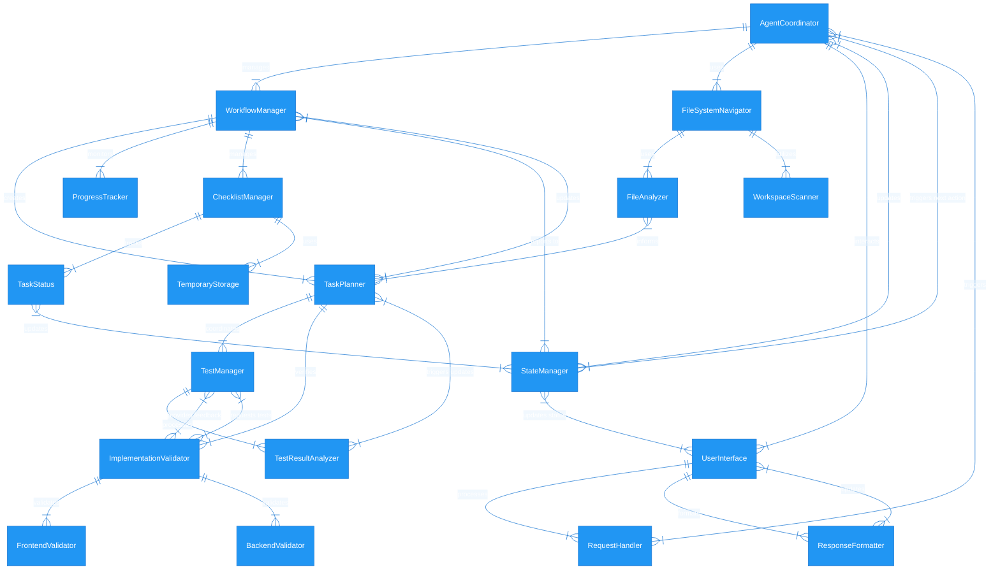

# **CodeMate – Din AI-drivna kodassistent**  

### 🤖 _Låt AI bygga, förbättra och testa kod åt dig_  

**CodeMate** är en **semi-autonom kodassistent** som hjälper dig att **bygga nya funktioner steg för steg på ett säkert sätt**, samtidigt som den **automatiskt testar varje implementering**. Den analyserar kodbasen, identifierar relevanta filer och säkerställer att alla ändringar fungerar korrekt innan de införs i systemet.  

---

## 🔹 **Hur fungerar CodeMate?**  

🗂 **Läser och förstår din kodbas**  
   - Skannar alla filer i `./Workspace/` och skapar en **översikt över projektet**.  
   - Identifierar automatiskt **vilka filer som är viktiga för frontend och backend**.  

🎯 **Planerar och genomför uppgifter steg för steg**  
   - När du ger en instruktion (prompt) skapar CodeMate en **arbetsplan** med tydliga steg.  
   - Använder en **interaktiv checklista** för att hålla koll på vad som är gjort och vad som återstår.  

🛠 **Bygger nya funktioner & fixar kod automatiskt**  
   - **Implementerar nya funktioner** baserat på din beskrivning.  
   - Analyserar befintlig kod och avgör **var och hur den nya funktionen ska läggas till**.  
   - Säkerställer att frontend och backend hänger ihop och kommunicerar korrekt.  

🧪 **Testar alla ändringar automatiskt**  
   - Skapar och kör tester för att validera både **nya funktioner och buggfixar**.  
   - Om något går fel, analyserar CodeMate felet och justerar koden.  

📊 **Håller koll på projektets framsteg**  
   - Sparar all data i en **tillfällig arbetsyta**, så att information inte går förlorad om något måste göras om.  
   - **Arbetar tills hela uppgiften är slutförd**, vare sig det handlar om en ny funktion eller en förbättring av befintlig kod.  

🔄 **Redo för nästa uppdrag**  
   - När alla ändringar är klara och testade, går CodeMate tillbaka till **standby-läge** och väntar på din nästa instruktion.  

---

### **Varför använda CodeMate?**  

🏗 **Implementerar nya funktioner på din begäran** – Du beskriver, CodeMate bygger!  
🔧 **Fixar kod & testar själv** – Säkerställer att allt fungerar innan du ens behöver dubbelkolla.  
⏳ **Sparar tid** – Automatiserar underhåll och testkör så att du kan fokusera på viktigare saker som vilka funktioner som faktiskt ska implementeras.  
💡 **CodeMate är som en utvecklarkompis som både fixar buggar och bygger nya funktioner åt dig!**  

