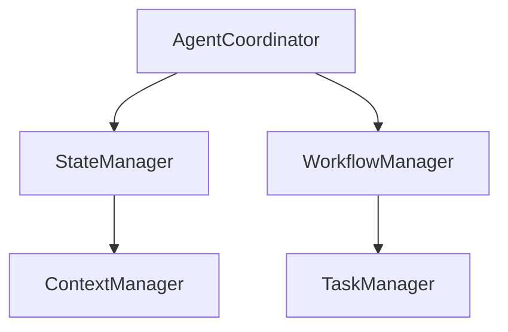
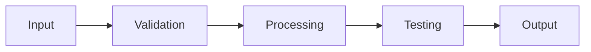

# docs/architecture/system_design.md
# System Design

## Components

### Core System

```mermaid
graph TD
    A[AgentCoordinator] --> B[StateManager]
    A --> C[WorkflowManager]
    B --> D[ContextManager]
    C --> E[TaskManager]
```

### Processing Pipeline

```mermaid
graph LR
    A[Input] --> B[Validation]
    B --> C[Processing]
    C --> D[Testing]
    D --> E[Output]
```

[Detailed design documents...](./design/)
